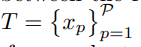
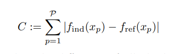

# Poznámky k bakalářské práci

## Dotazy:

Q: Když cituji citace někoho jiného, je doporučeno citovat původní zdroj?  
A: Je lepší citovat přímo původní zdroj, záleží samozřejmě na kontextu

Q: Jaký je doporučený postup? přečíst si více věcí z více zdrojů? Nebo už teď napsat něco málo co vím (hlavně k CGP obecně) a potom psát průběžně zatímco budu číst?  
A: Ještě není třeba psát, u bakalářky se nemusí psát už v zimním semestru.

Q: **Je dobrý nápad zkusit jako jeden z algoritmů to co navrhl Miller ve vícechromozomové reprezentaci?** 
A: Je to něco co bych si mohl vzít navíc, lepší by ale bylo, kdyby ty dva algorytmy byly mé vlastní

## K prozkoumání

- spojení mezi evoluční strategií a případným křížením.
- Vymyslet algorytmy :)

## Zdroje přečtené:

- [Cartesian Genetic Programming](https://link.springer.com/book/10.1007/978-3-642-17310-3) (z1)
- [Cartesian genetic programming: its status and future](https://link.springer.com/article/10.1007/s10710-019-09360-6) (z2)
- [Towards Discrete Phenotypic Recombination in Cartesian Genetic Programming](https://link.springer.com/chapter/10.1007/978-3-031-14721-0_5) (z3)
- [A Comparative Study on Crossover in Cartesian Genetic Programming](https://link.springer.com/chapter/10.1007/978-3-319-77553-1_13) (z4)
- [Genetic programming needs better benchmarks](https://dl.acm.org/doi/10.1145/2330163.2330273) (z7)

## Zdroje ke zvážení:

- [Positional Independence and Recombination in Cartesian Genetic Programming](https://link.springer.com/chapter/10.1007/11729976_32) z5
- [A New Crossover Technique for Cartesian Genetic Programming](https://www.researchgate.net/publication/220742582_A_new_crossover_technique_for_Cartesian_genetic_programming) z6

## Body ke kterým by se hodilo vyhledat informace a citace:

1. Lehký úvod do CGP (částečně možná popsat vlastními slovy, ale je lepší mít z čeho vycházet)
2. Proč je problém s křížením?
3. Jak funguje CGP bez křížení
4. Vymyšlené algoritmy křížení
5. Plusy, nedostatky daných algorytmů
6. Problémy které lze řešit CGP
7. Statistické metody na vyhodnocování

## 1. Lehký úvod do CGP

### Co je to bloat? (z1)

> When evolutionary algorithms are applied to many representations of programs, a
> phenomenon called bloat happens. This is where, as the generations proceed, the
> chromosomes become larger and larger without any increase in fitness. Such programs generally have large sections of code that contain inefficient or redundant
> subexpressions. This can be a handicap, as it can mean that processing such bloated
> programs is time-consuming. Eventually, an evolved program could even exceed
> the memory capacity of the host computer. In addition, the evolved solutions can be
> very hard to understand and are very inelegant. There are many theories about the
> causes of bloat and many proposed practical remedies [36, 37, 41]. It is worth noting
> that Cartesian GP cannot suffer from genotype growth, as the genotype is of fixed
> size; in addition, it also appears not to suffer from phenotypic growth [27]. Indeed, it
> will be seen that program sizes remain small even when very large genotype lengths
> are allowed

### Proč "Kartezske" geneticke programovani? (z1)

> It is called ‘Cartesian’ because it represents a program
> using a two-dimensional grid of nodes

### Obecná struktura CGP (z1)

> In CGP, programs are represented in the form of directed acyclic graphs. These
> graphs are represented as a two-dimensional grid of computational nodes. The genes
> that make up the genotype in CGP are integers that represent where a node gets its
> data, what operations the node performs on the data and where the output data required by the user is to be obtained.

### Co jsou to "non-coding" uzly (z1)

> When the genotype is decoded, some nodes may be ignored.
> This happens when node outputs are not used in the calculation of output data.
> When this happens, we refer to the nodes and their genes as "non-coding".

### Genotyp a fenotyp a jejich velikost v CGP (z1)

> We call the program that results from the decoding of a genotype a phenotype. The
> genotype in CGP has a fixed length. However, the size of the phenotype (in terms of
> the number of computational nodes) can be anything from zero nodes to the number
> of nodes defined in the genotype.

Dá se teda říct že genotyp se skládá z veškerých uzlů které jedinec obsahuje.
Fenotyp se pak skládá z uzlů (nebo spíše z jejich přeložení), které nejsou "non-coding" - tedy jsou "encoding" hádám.

### Typy genů v uzlech (function vs connection) (z1)

> In CGP, each node in the directed graph represents a particular function and is encoded by a number of genes. One gene is
> the address of the computational node function in the function look-up table. We
> call this a **_function gene_**. The remaining node genes say where the node gets its data
> from. These genes represent addresses in a data structure (typically an array). We
> call these **_connection genes_**.

### Typy funkcí v uzlech (z1)

> The types of computational node functions used in CGP are decided by the user
> and are listed in a function look-up table

### Odkud berou uzly své vstupy (z1)

> Nodes take their inputs in a feed-forward manner from
> either the output of nodes in a previous column or from a program input (which is
> sometimes called a terminal).

### Počet vstupů do uzlu (z1)

> The number of connection genes a node has is chosen
> to be the maximum number of inputs (often called the arity) that any function in
> the function look-up table has.

### Volitelné parametry CGP (z1)

> CGP has three parameters that are chosen by the user. These are the **_number
> of columns_**, the **_number of rows_** and **_levels-back_**. These are denoted by nc, nr and
> l, respectively. The product of the first two parameters determine the maximum
> number of computational nodes allowed: Ln = ncnr. The parameter l controls the
> connectivity of the graph encoded. Levels-back constrains which columns a node
> can get its inputs from. If l = 1, a node can get its inputs only from a node in the
> column on its immediate left or from a primary input.

### Dekódování Genotypu (z1)

> the algorithmic process is recursive in nature and works from the output
> genes first. The process begins by looking at which nodes are ‘activated’ by being
> directly addressed by output genes. Then these nodes are examined to find out which
> nodes they in turn require.

### Neutral drift

(z1)

> We have already seen that in a CGP genotype there may be genes that are entirely
> inactive, having no influence on the phenotype and hence on the fitness. Such inactive genes therefore have a neutral effect on genotype fitness. This phenomenon is
> often referred to as neutrality. CGP genotypes are dominated by redundant genes.
> For instance, Miller and Smith showed that in genotypes having 4000 nodes, the
> percentage of inactive nodes is approximately 95%! [6].

(z2)

> The 1 + lambda
> -inspired algorithm promotes neutral drift since often mutational ofspring difer
> only in inactive genes and so have equal ftness to their parent [69, 110, 119, 128,
>
> > 129]. Such identical ofspring can be detected before ftness evaluation so incurring no ftness calculation. Thus, even when it appears that the algorithm is stuck
> > on a local optimum ftness value the search algorithm is exploring many possible
> > diferent solutions by mutating diferent genotypes.

### Alternativní genotypové reprezentace (z2)

- Parallel distributed genetic programming
- Modular
- Real‑valued
- Implicit context
- Self‑modifying
- Mixed‑type
- Iterative
- Diferentiable CGP
- Graph programming
- Positional CGP

## 2. Problémy s křížením

### Původní křížení v CGP (z1)

> Crossover operators have received relatively little attention in CGP. Originally, a
> one-point crossover operator was used in CGP (similar to the n-point crossover in
> genetic algorithms) but was found to be disruptive to the subgraphs within the chromosome, and had a detrimental affect on the performance of CGP [5].

### Hladkost a drsnost série fitness evaluací (z2)

> Slaný and Sekanina examined how various crossover operators and standard
> mutation afected the smoothness and ruggedness of the series of ftness values of
> the best population member in each generation. They examined this in the domain
> of CGP applied to image flter design. They found that either point mutation (with
> lambda = 7) or single-point crossover where only one ofspring of the crossover operation
> is mutated and included into the new population, generated the smoothest ftness
> landscape.

## 3. Jak funguje CGP bez operátoru křížení

- **_TODO_** najít nějaký vhodný zdroj který toto možná popisuje? Možná jen popsat mými slovy?
- Využívá se pouze operátor pro mutace
- Důležitý pojem - **_neutral drift_** - v podstatě mutace "non-coning" genů které se neprojeví na FIT hodnocení jednotlivce, ale pomáhá aby algorytmus nezůstal v lokálním minimu

## 4. Různé algoritmy křížení

### FP crossover operátor (z1)

> Some work by Clegg et al. [2] has investigated crossover in CGP (and GP in general).
> Their approach uses a floating-point crossover operator, similar to that found in evolutionary programming, and also adds an extra >layer of encoding to the genotype, in which all genes are encoded as a floating-point number in the range [0,1].
> A larger population and tournament selection were also used instead of the (1 + 4) evolutionary strategy normally used in CGP, to tr>y and improve the population diversity.
> The results of the new approach appear promising when applied to two symbolic regression problems, but further work is required on a >range of problems in order to assess its advantages [2].

### Nalezená využití operátoru křížení (z1)

> Crossover has also been found to be useful in an imageprocessing application as discussed in Sect. 6.4.3. Crossover operators (cone-based
> crossover) have been devised for digital-circuit evolution (see Sect. 3.6.2). In situations where a CGP genotype is divided into a collection of chromosomes, crossover
> can be very effective. Sect. 3.8 discusses how new genotypes created by selecting
> the best chromosomes from parents’ genotypes can produce super-individuals. This
> allows difficult multiple-output problems to be solved.

**_TODO najít si definici cone-based crossover_**

### Diskrétní fenotypní rekombinace (z3)

> We adapt discrete recombination in CGP by means of phenotypic functional
> variation which is performed through the exchange of function genes of active
> function nodes. The phenotype of a CGP individual is represented by its active
> function nodes which are determined before the crossover procedure. After selecting two individuals, the minimum and a maximum number of active function
> nodes of the two individuals is determined. The reason for this is that the size of
> the phenotype in CGP is not fixed and can vary among individuals. To perform
> the exchange of active function genes, the crossover procedure iterates over the
> minimum number of active nodes. A binary decision is made by chance in each
> iteration whether the function genes are swapped or kept. In the case that both
> phenotypes differ in size, our method performs a special step in the last iteration called boundary extension which extends the selection of active function
> genes. The idea behind this step is to include active function genes of the larger
> phenotype into the selection which would not be considered if the lists of active
> function nodes are merely interated in order. Just like the uniform crossover in
> GA, our method produces two offspring.

Výsledky:

> Overall, our results indicate that the use of our proposed
> methods can be beneficial for symbolic regression

### Více chromozomová reprezentace (z2)

> Walker et al. devised a multi-chromosome representation which could be applied
> to special classes of problems [124]. They looked at seven multiple output digital
> circuit problems and instead of allocating as many output genes as circuit outputs
> they divided the genotype into as many chromosomes as the number of outputs. For
> the problems chosen (all digital circuits) the ftness of each chromosomes could be
> assessed independently. The parent genotype in the 1 + lambda EA was constructed by
> choosing each of the fttest chromosomes. For all benchmarks this produced spectacularly better results than the one chromosome version. Indeed for one problem it
> was possible to evolve a solution approximately 392 faster than using a single chromosome with the same total number of nodes.

Návrh na možnost pro vícechromozomové řešení u problémů kde nelze hodnotit chromozomy samostatně: (z2)

> However, most computational problems do not have the property that multiple
> outputs can be evaluated for ftness independently. It would be interesting to investigate a multi-chromosome form of CGP in such cases. One way this could be done
> would be to allow multiple chromosomes each providing a single output and also
> having an additional “coordinator”chromosome which uses the outputs of the other
> chromosomes as inputs. Fitness would be determined from the coordinator chromosome only. This would allow parent genotypes to produce ofspring by crossover of
> non-coordinator chromosomes. Indeed, the coordinator chromosome would be free
> to utilise any or all of the non-coordinator chromosomes.

### Cone-based crossover (z2)

> In their work on new techniques for acquiring modules in modular CGP (see
> Sect. 3.2), Kaufmann and Platzner also investigated a cone-based crossover operator
> to be used with a genetic algorithm (rather than 1 + lambda-ES). This generates a recombined chromosome by transplanting a cone of a donor chromosome into a clone of a
> recipient chromosome. They investigated the utility of the crossover operator using
> various population sizes using a genetic algorithm. They found smaller population
> sizes worked best in the new approach but it only performed better than the original
> modular CGP technique on two of the six benchmark problems (two and three-bit
> multipliers).

### sub-graph crossover (z2)

> Kalkreuth et al. have recently investigated sub-graph crossover in CGP [35]. Subgraph crossover is like single-point crossover except that the active nodes both sides
> of the crossover point are preserved. The crossover point is always chosen so that
> it lies between nodes. This idea of sub-graph crossover is that it should reduce the
> disruption caused by single-point crossover in standard CGP and truly recombine
> meaningful sub-graphs. If after single-point crossover active genes would change
> then the connection genes on the right of the crossover point are randomly re-generated to preserve the active genes on the left of the crossover point. They used a
> standard genetic algorithm with population size 50 and tournament selection.

### block crossover (z2)

> Kalkreuth and Husa have recently proposed block crossover [32]. This is defned
> using the one-dimensional representation of CGP. First before carrying out block
> crossover blocks must be identifed in two parent genotypes. Blocks are groups of
> nodes that meet the following criteria: (1) The block contains a desired number of
> nodes, (2) All nodes in the block are directly linked through their inputs or outputs,
> (3) All nodes in the block are part of the genotype’s active path. Block crossover
> then randomly selects one block from each genotype and swaps them. The position
> of the nodes transferred as part of the block may change inside the new genotype.
> However, their mutual links are preserved and the function performed by the block
> stays the same. After block crossover, point mutation is applied. They conducted
> parameter sweeps with standard CGP (1 + lambda) versus genetic algorithms using block
> crossover on a suite of Boolean functions and symbolic regression problems. They
> found that there was no single set of crossover parameters that worked best over the
> problems. They also found that the best value of lambda varied with problem. Although it
> is possible for crossover operators to outperform the standard 1 + lambda strategy, if both
> methods have their parameters fne-tuned, the 1 + lambda strategy usually remains as the
> overall best strategy.

**_TODO_** Najít si zdroje ze kterých čerpal Miller co se týče daných algoritmů křížení, a přečíst si něco z nich

## 6. Problémy které lze řešit CGP

- (z7) Obecné třídy pro benchmarky v GP:

  - Regrese
  - Klasifikace
  - Binární funkce
  - Prediktivní modeling
  - hledání cesty
  - ...

- Chci se nejspíš zaměřit na regresi

### Symbolická regrese (z1)

- Co to vlastně znamená, jak se používá?

  > Given two equal-sized data sets, the aim of the symbolic regression problem
  > is to find a symbolic function which maps each point in the first data set to the
  > corresponding point in the second data set, within a certain degree of error. For
  > example, the solution to the symbolic regression problem f(x) = x3 −x2 +x would
  > map each point in the x data set to the corresponding point in the f(x) data set.

- Jaké funkce typicky regrese zahrnuje?

  > The function set used for the symbolic regression problem typically comprises
  > the functions: addition, subtraction, multiplication and protected division (division
  > by zero returns a result of 1). This function set was used for both experiments described in this section. However,occasionally other functions such as sine, cosine,
  > log and exponential are used in the function set when the symbolic regression problem requires it [11].

- Jak se vyhodnocuje?

  > The fitness function used to distinguish between individuals in the population
  > was the absolute error of the function over all the points in the input set. This is
  > the sum of the absolute differences between the calculated output of each individual
  > and the value for the point in the output set, for all points contained in the output
  > set. The criterion for successfully finding a solution was that the absolute error of
  > each point was within 0.01 of the corresponding point in the output set.

- z3 měli vyhodnocení regrese následovné:
  > The fitness of the individuals
  > was represented by a cost function value. The cost function was defined by the
  > sum of the absolute difference between the real function values and the values
  > of an evaluated individual. Let  be a training dataset of P random
  > points and find(xp) the value of an evaluated individual and fref(xp) the true
  > function value. Let
  > 
  > be the cost function. When the difference of all absolute values becomes less
  > than 0.01, the algorithm is classified as converged.

Ve zkratce (dle mého chápání):

- Regrese je jeden z typů problémů, na kterých se dají testovat evoluční algorytmy
- Jsou dva datasety: původní a namapovaný pomocí nějaké funkce (třeba zmníněná f(x) = x3 −x2)
- Při iterování CGP se vlastně chceme co nejvíce přiblížit tomu, aby jednotlivec měl v sobě zakódovanou tu funkci, která byla použita, nebo se k ní co nejvíce přiblížit
- Jako fitness funkci používáme to, že namapujeme původní dataset pomocí fenotypu jednotlivce, a následně zkontrolujeme jak velký je rozdíl (chyba) mezi tímto datasetem a datasetem namapovaným hledanou funkcí

## 7. Statistické metody na vyhodnocování

- medián počtu evaluací (median number of evaluations) vs výpočetní náročnost (computational-effort)
  - **_TODO_** Jak přesně se zjiťují a co přesně znamenají? dohledat.
  - Počet evaluací se bere jako počet fitness evaluací? možná.

### Mann–Whitney U test

- byl použit v z1 pro statistickou signifikanci, při porovnávání CGP a ECGP u symbolické regrese
- byl využit i u z3
- Mann-whitney se hodí, když nemůžeme zaručit normální rozložení našich vzorků.(z2) (proto se nejspíš použilo v obou případech)
- Používá tzv "rank sum difference" = v obou skupinach (dohromady) ohodnotíme seřadíme položky od 1 do ..., podle hodnoty. Sečteme v každé skupině ranky všech položek, které do ní patří. Dostaneme <em>T1</em> a <em>T2</em>
- Dále jde přes vzorce vypočítat <em>U</em> hodnoty, <em>z</em> hodnotu a <em>p-hodnotu</em>
- na základě p hodnoty lze odhadnout, jak je náš experiment signifikantní. Obecně se bere, že p-hodnota by měla být alespoň 0,05

- [Krátké video kde vysvětlují základ](https://www.youtube.com/watch?v=LcxB56PzylA)
- [Prezentace University Karlovy](https://www.karlin.mff.cuni.cz/~zvara/geograf/0708/geo4Predn09.pdf)

# Návrhy algorytmů

## Vícechromozomové řešení s koordinátorem

- zmíněno v z2
- Nevím jestli by bylo bráno jako mé řešení podle zadání, protože jsem ho technicky "nevymyslel"
- Neviděl jsem návrh ale nikde zpracovaný, tak by to možná nebyl špatný nápad
- je to i celkem blízko k představě kterou jsem měl.
- **TODO** zeptat se vedoucího na názor

> However, most computational problems do not have the property that multiple
> outputs can be evaluated for ftness independently. It would be interesting to investigate a multi-chromosome form of CGP in such cases. One way this could be done
> would be to allow multiple chromosomes each providing a single output and also
> having an additional “coordinator”chromosome which uses the outputs of the other
> chromosomes as inputs. Fitness would be determined from the coordinator chromosome only. This would allow parent genotypes to produce ofspring by crossover of
> non-coordinator chromosomes. Indeed, the coordinator chromosome would be free
> to utilise any or all of the non-coordinator chromosomes.

## Implantace aktivních genů do pasivních

Ve dvou jedincích se zjišťuje, zda mají nějaký aktivní prvek na stejné pozici, jako nějaký pasivní druhého jedince. Bude se provádět bodové křížení
Pokud ano:

### a) fenotypicka moznost

Operace se pasivního genu jedince 1 se nahradí operací aktivního genu jedince 2.
Případně se upraví počet vstupů tak, aby odpovídal nové operaci.

### b) Bodové křížení

Vymění se operace spolu se vstupy (tedy celý gen) - nejspíše dává vštší smysl, jelikož už tak budou pasivní geny hrát malou roli

***TODO:chyba v obrazku, uzel ctyri je pasivni, ne aktivni!!! opravit nez se to da do bakalarky... mozna je to i u druheho obrazku***

***TODO:chyba v obrazku, nesedi genotyp (zapsany cisly) pro treti gen rodice jedna, vstupy jsou 1, 1 a ne 0, 0 (zkontroluj radsi vse)***

## Fenotypická výměna podgrafů proměnlivé velikosti

Při průchodu jedinci, najdu všechny indexy, kde mají oba jedinci aktivní gen a jedno z nich vyberu.
Následně:

Prohodím operace genů, pokud nesedí počet vstupů, provedu případné úpravy.
Vezmu minimum z počtu vstupů obou jedinců, a s pravděpodobností P se rozhodu, že půjdu po 1. vstupech těchto genů dále. (v podstatě takové zanořování do hloubky).
Opět prohodím operace obou genů, a provedu to samé. Pokud narazím na celkový vstup genotypu, tak již nepostupuju dále.

- Varianta a: Rozhodujeme se s konstantní pravděpodobností, třeba 1/2
- Varianta b: Rozhoduje me se s postupně snižující se pravděpodobností, třeba podle hloubky zanoření (tedy koren vybirame s P = 1 prvního genu je P = 1/2 ze pujdeme dal, u dalsich je to 1/3...)
- Varianta c: Budeme se zanorovat dokud to lze, tedy s P = 1

Pozn.: AAAAAAAAAAAAAAAAAAAAAAAAAAAAAAAA teď když jsem se koukl na to jake jsou algorytmy, tak je to dost podobné výsledku Blokového křížení. Rozdílem je jenom proměnné délka a šířka... Takže Block crossover je podmnožina tohoto algorytmu, pokud by byla pevně daná hloubka a hledalo by se do šířky.

Pozn. 2: Jeste jeden rozdíl, u mého algorytmu se začíná na stejném indexu, u Block Crossover se může být kořen na různé pozici. 

- Nevýhoda: implementace algorytmu s pravděpodobností může žrát více výpočetního času, než je jeho přínos... i kdyz mozna ani ne, kdyz se stejne nahodne vybiraji mista krizeni apod.

# Bakalářka - písemná část
## Nadpisy
1. úvod
2. abstrakt
3. Evoluční algorytmy
  - úvod 
    - definice, neco s evolucí
    - historie
  1. pojmy
    - gen
    - genotyp
    - chromozom
    - jedinec
    - populace
      - obrazek - gen, genotyp, chromozom, jedinec, populace (binarni retezce)
    - mutace
    - rekombinace
      - obrazek (binarni retezce)
    - genotyp
    - fenotyp
    - fitness
    - selekce
      - definice
      - turnaj
        - obrazek
    - generace
  2. genetické programování
    - uvod
    - definice
    - rozdily
  3. Symbolická regrese
    - co to je symbolická regrese (GP koza)
    - booleovske funkce jako speciální případ symbolické regrese
4. Kartézské genetické programování
  - historie
  - definice
  - 1 + lambda
  1. problematika krizeni
  2. neci algoritmus
  3. neci algoritmus
  .
  .
  .
5. Návrh
  - uvod
  1. algoritmus 1
    - inspirace
    - popis
    - obrázek
    - myslenka za algoritmem
  2. algoritmus 2
    - inspirace
    - popis
    - obrázek
    - myslenka za algoritmem
6. implementace
  - uvod...
  - doplnit az bude treba

7. Experimentace

8. závěr

ukladat fitness a generaci pokazde kdyz se najde lelpsi reseni

metacentrum